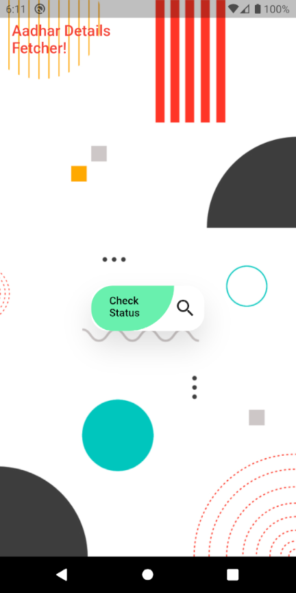
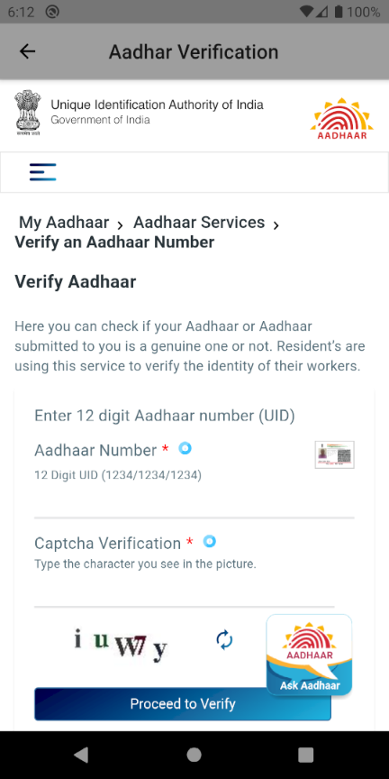

# aadhar_webview

Application to load and implement aadhar website inside webview

## Getting Started

This project is to access uidai's website in a webview, fetch data and refactor and reroute the json contents into an appview page!

## Images

## AppBase

This app captures data indexes from the loaded URL using webview plugin, parses html contents and sends back to system via print stream.
